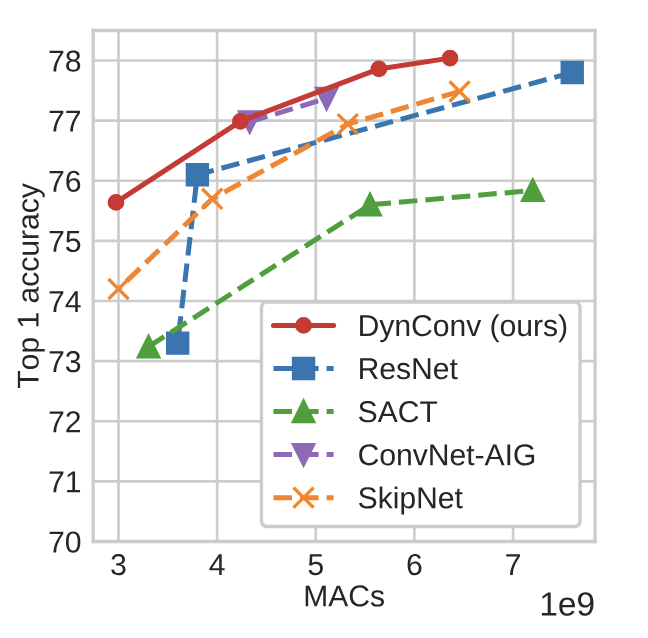
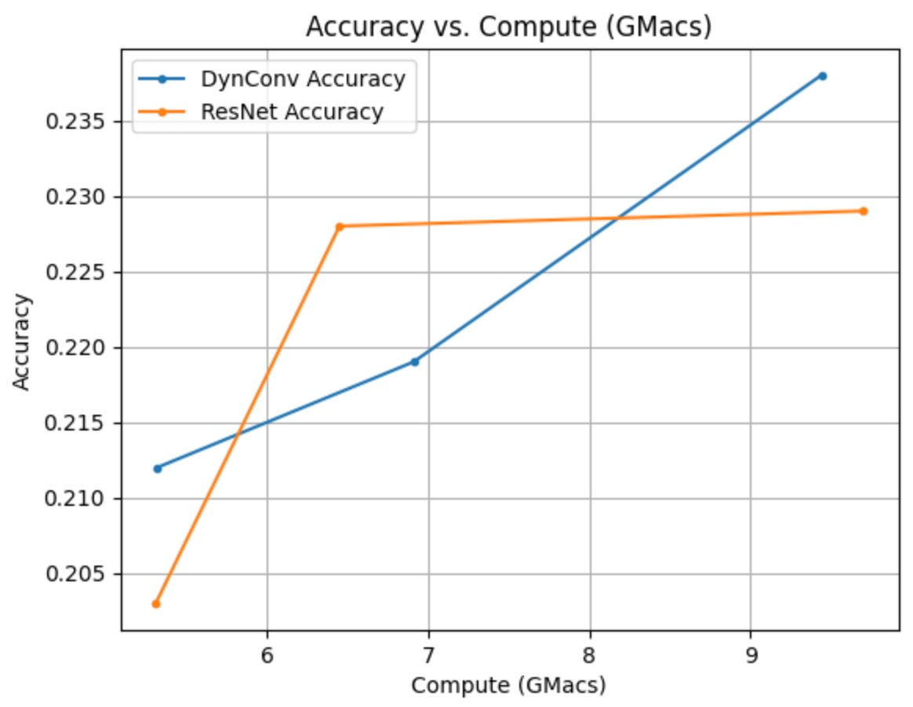

# dynconv-4782

Final project for CS 4782 where we reimplement Dynamic Convolutions.

## Introduction

In CS4782, we primarily learned about how modern CNNs apply the same operations on every single pixel in an image. However, we may not need to apply these operations on every single portion of the image. In fact, Thomas Verelst and Tinne Tuytelaars aimed to make convolutional neural networks faster by dynamically applying convolutions to certain regions of the image in their paper “Dynamic Convolutions: Exploiting Spatial Sparsity for Faster Inference.” This paper was submitted to CVPR 2020. Their goal was to ultimately apply dynamic convolutions to make the network more efficient, and able to run on less powerful machines.

## Chosen Result

The specific result we aimed to reproduce was this image. 

Here, it is comparing the computational complexity (measured in MACs) of models like ResNet in comparison to their model, DynConv. They wanted to illustrate that the DynConv infrastructure works more efficiently than other models at different computational powers.

We chose this result because the paper’s main contribution is describing how these are computationally more efficient than existing architectures. Thus, we wanted to be able to take the models that we learned in class and use it as a point of reference for the comparison.

## Reimplementation Details

For our reimplementation, we utilized the same dataset they did - the Food101 dataset. For the model architecture, we followed the model architecture that they used. Here, we first created our own “DynamicLayer” implementation. The structure within the DynamicLayer is similar to the ResNet - it contains a 1x1 Conv2d, BatchNorm2d, a 3x3 Conv2d, a second BatchNorm2d, a 1x1 Conv2d, and another BatchNorm. Then, we use ReLU and downsample (depending on the structure of ResNet and where in ResNet they downsample). The difference is that our DynamicLayer also includes a MaskUnit that is masking out the pixels, while also getting the hard decision boundaries. This closely follows the way that the researchers implemented it to our understanding. However, the biggest difference in terms of architecture is that we did not utilize the researcher’s “gather” and “scatter” operations, as we were told by the instructors for the course that we would not do it since it is meant to speed up inference. The overall DynamicArchitecture follows ResNet50’s architecture very closely, with the addition of the masking operations that we created.

For evaluation metrics, we kept track of the training loss at each batch, the loss at each epoch, the validation loss at each epoch, and the accuracy for each epoch. We also tracked the computational complexity of the model depending on the model inputs we would include for GMACs measurements. To measure this, we utilized the library “ptflops,” which is an open-source Python library to count FLOPs and GMACs in neural networks. Thus, we adjusted the inputs such that we could measure our model at different input sizes and get the complexity at different GMACs. This is different from their implementation, since they created specific environments for this type of testing and had code to control threading and such to control the budget.

In terms of modifications, we had to adjust the way we trained the dataset, evaluating the model, and setting up the model due to computational constraints. This is discussed in depth in the analysis, as a part of the discrepancies of the implementation here: [Challenges, Discrepancies, Analysis](#challenges-discrepancies-analysis).

To run this code, there needs to be a GPU. In addition, to include the evaluation metrics, we included the command `!pip install ptflops` to import the ptflops library, which will be tracking the GMACs of the model.

To replicate the results, we adjusted the parameters by changing mac_params_resnet and mac_params_convnet to change the GMACs in the graph.

For mac_params_convnet we used an input_constructor (the second parameter of `get_model_complexity`) in the ptflops library of (3, 175, 200) as the parameters to receive GMACs of 5.32. We used (3,180,256) to get GMACs of 6.91. We used (3, 256, 256) to get GMAC of 9.44.

For mac_params_resnet we used an input_constructor (the second parameter of `get_model_complexity`) in the ptflops library of (3, 175, 200) as the parameters to receive GMACs of 5.31. We used (3,256,300) to get GMACs of 6.45. We used (3, 250, 450) to get GMAC of 9.7.

## Results and Analysis

### Results

Based on the results, we can observe that there is a slight increase in accuracy as the GMACs increase within the DynConv implementation, as it goes from 0.219 accuracy to 0.238 when the GMACs increased from 6.91 to 9.44. In addition, we can see that once the GMACs increase to approximately 8.3, the DynConv accuracy exceeds that of the ResNet implementation. Based on these results, we can observe that the overall trend that DynConv is better computationally than the ResNet is seen at higher GMACs.

In addition, we can see that the DynConv implementation actually starts with exceeding the accuracy of ResNet at a lower GMAC of 5.32. Then, ResNet overtakes it in terms of accuracy until around 8.3 GMACs, before DynConv takes over again. This could be due to the model overfitting at a certain point, before it begins learning again.

There are discrepancies in our results compared to the model - especially in terms of the accuracy rates that they were receiving. We address these discrepancies later in this report in the section on [Challenges, Discrepancies, Analysis](#challenges-discrepancies-analysis).

For more specific result details, please reference [Results](results/raw_results.csv) to see the specific numbers and correlated parameters.

### Challenges, Discrepancies, Analysis

Overall, there are certainly parts of the implementation that we were unable to determine, and thus we had to go with our best interpretation of what the paper was describing to build out the architecture and properly evaluate the best we could with the limited compute power that we had.

One of the biggest challenges we’ve faced was figuring out how the architecture of the dynamic convolution was integrated with ResNet, since we were looking to compare the modified DynConv Residual Network with the pretrained ResNet, since their integration details were never explicitly stated in the main paper or the supplemental material. It wasn’t until we read what they did with other architectures that we understood that the authors replaced each of the residual blocks of the ResNet with their custom Dynamic Convolution blocks. Since we were replacing all the residual blocks of the ResNet with our custom DynConv blocks, we were thus unable to take advantage of the pretrained weights of ResNet50. We thought this tradeoff was fine as long as the ResNet we were comparing to was initialized as pretrained.

The majority of our discrepancies were due to our computational constraints. We only had access to 1 T4 GPU with limited runtime and limited RAM, whereas the authors had access to multiple GPUs with much longer runtimes. Because of these discrepancies, we needed to use a smaller dataset and limit the amount of compute we could use. The original Food-101 dataset had 101,000 images with 101 classes, training with a batch size of 64, for 100 epochs. With these parameters, it took approximately 2 hours to run one epoch, and by the second epoch, we had run out of RAM. To mitigate this, we randomly selected 6 classes to keep in our dataset and removed the other images. We also reduced the batch size to 32 and trained it for only 10 epochs. In addition, due to the computational limits with our GPU and RAM availability, we were only able to graph results for ResNet and DynConv. Whenever we attempted to import our ConvNet architecture, we would exceed the limit upon running it, and so we decided it would be best to focus on just ResNet and DynConv. With these changes, we did not expect to reach the accuracy levels that the authors obtained, but we were hoping to be able to graph the overall trends of accuracy vs. MACs.

Lastly, the authors were able to test for different MACs by adjusting their computational budget. Unfortunately, with the hardware we were given, we were unable to set up the appropriate scripts to adjust our computational budget. However, we did realize that in the `ptflops` package that we were using to measure MACs and FLOPs, there is an input to the method `get_model_complexity_info` which is able to change the size of the input to our model, which also changes MACs, so we’ve been indirectly changing MACs by changing the size of our input. Since these are confounding variables, it’s unclear in our implementation whether this is a causal effect.

Based on these results and with the discrepancies in the results, we can still see that with an increase in the MACs, we observe that the DynConv implementation is more accurate than ResNet at higher MACs, as we are convolving on a certain number of pixels within the image, rather than every single part of the image itself like it would in ResNet. With the Gumbel-Softmax, we can determine which parts of the image are best for the decision-making process of whether a portion is important or not, and thus can make hard decisions on which parts of the image can be zeroed out or need to be convolved and trained on. Thus, even at our smaller scale experiment, we were able to see differences.

## Conclusion and Future Work

Overall, these results are different from the original paper’s results. However, it is expected since we used significantly less training data and less complex models to run it within the computation budgets. We both learned a lot about how to interpret research papers and use it to reimplement their results. In addition, both my partner and I have never heard about the Gumbel Softmax equation or its significance, so it was interesting to research and see how it correlates to some of the learnings that we had in the class. Lastly, from a programming standpoint, we learned a lot about how to utilize limited compute power and data storage.

In the future, we would like to try to access a little bit more compute power so that we could try to further attempt to train on a larger data set. In addition, we want to attempt to further utilize and attempt to rebuild the infrastructure so that we can support gather and scatter operations and measure the time.

## References

Verelst, Thomas, and Tinne Tuytelaars. “Dynamic Convolutions: Exploiting Spatial Sparsity for Faster Inference.” 2020 IEEE/CVF Conference on Computer Vision and Pattern Recognition (CVPR), 2020, pp. 2317–26. arXiv.org, https://doi.org/10.1109/CVPR42600.2020.00239.

https://openaccess.thecvf.com/content_CVPR_2020/supplemental/Verelst_Dynamic_Convolutions_Exploiting_CVPR_2020_supplemental.pdf

https://github.com/sovrasov/flops-counter.pytorch
